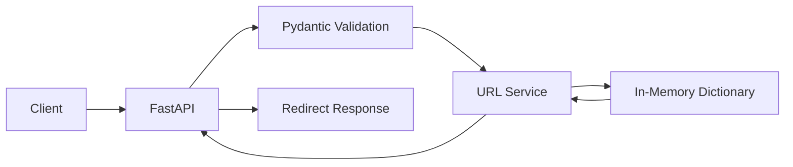
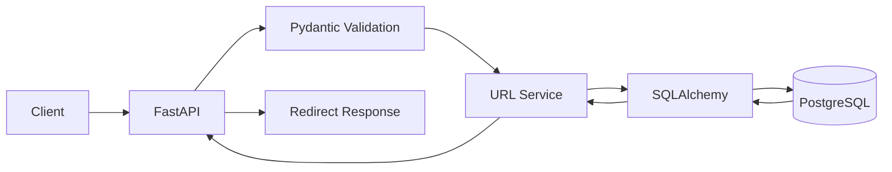
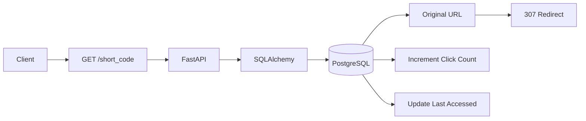
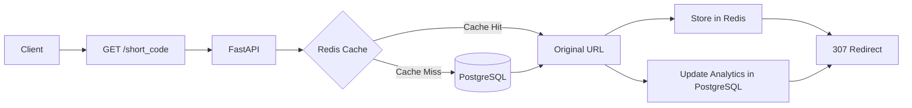
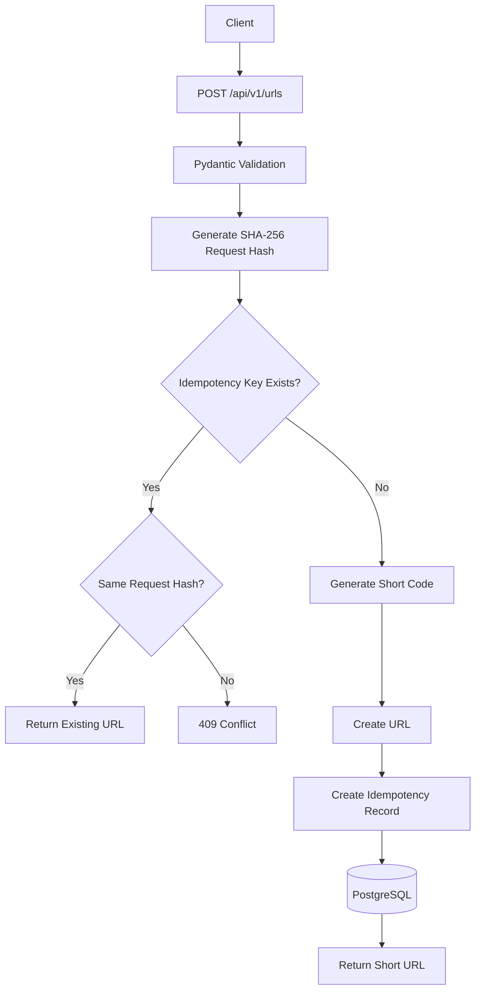
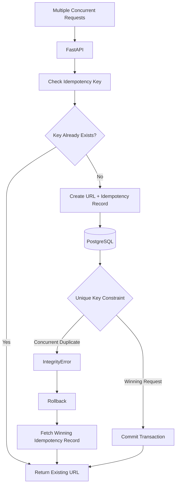
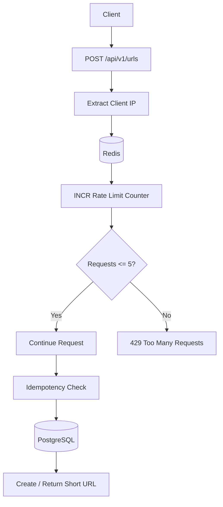
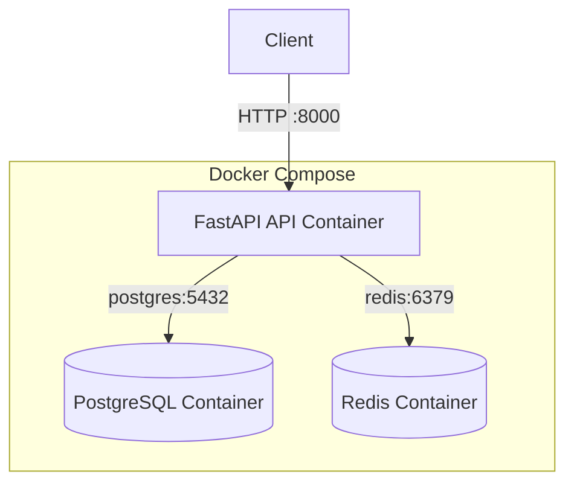
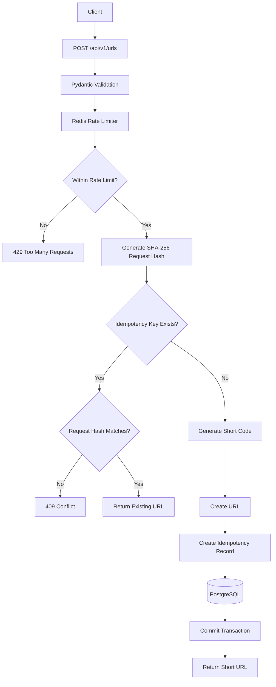
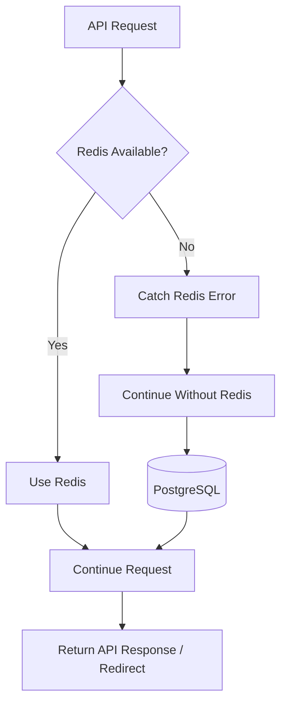

# URL Shortening & Analytics Service

A backend project built progressively to learn backend engineering concepts and system design.

## V1 — Basic URL API

### 1. Implemented:

- FastAPI application
- URL validation using Pydantic
- Short-code generation using Base62-style characters
- In-memory URL storage
- URL creation API
- Basic redirect API
- 404 handling for unknown short codes

### 2. Architecture



### 3. Limitations:

- Data is stored only in memory.
- All URL mappings are lost when the application restarts.
- No persistent database.
- No analytics or click tracking.
- No caching.
- No idempotency or concurrency handling.
- No rate limiting.


## V2 — PostgreSQL Persistence

### 1. Implemented

- PostgreSQL database integration
- SQLAlchemy ORM
- URL database model
- Persistent URL storage
- Database sessions
- URL retrieval from PostgreSQL
- Database-level unique constraint on short codes
- PostgreSQL-backed redirects

### 2. Architecture



### 3. Limitations

- No click analytics yet.
- Every redirect queries PostgreSQL.
- No Redis caching.
- No idempotency.
- No concurrency protection for duplicate creation requests.
- No rate limiting.

## V3 — Redirect Analytics

### 1. Implemented

- Click count tracking
- Last accessed timestamp
- PostgreSQL-backed analytics updates
- Persistent analytics data on every successful redirect

### 2. Architecture



### 3. Limitations:
- Every redirect queries PostgreSQL.
- High redirect traffic can increase database load.
- No caching yet.
- No Redis integration.
- No idempotency or rate limiting.


## V4 — Redis Caching

### 1. Implemented

- Redis integration for URL caching
- Cache-aside pattern for short-code lookups
- Redis cache HIT and MISS handling
- PostgreSQL fallback on cache MISS
- 1-hour TTL for cached URLs
- Graceful fallback when Redis is unavailable
- PostgreSQL remains the source of truth
- Analytics continue to be stored in PostgreSQL

### 2. Architecture




### 3. Limitations

- Analytics still require a PostgreSQL operation on every redirect.
- Cache invalidation is not implemented because URL updates are not currently supported.
- Redis failure can add latency because the application first attempts the Redis connection before falling back to PostgreSQL.
- No rate limiting yet.
- No idempotency or concurrent-request protection yet.


## V5 — Idempotent URL Creation

### 1. Implemented

- Idempotency-Key support for URL creation requests
- PostgreSQL-backed idempotency records
- SHA-256 request fingerprinting
- Detection of repeated requests using the same Idempotency-Key
- Repeated identical requests return the same short code
- Reuse of an Idempotency-Key with different request data returns `409 Conflict`
- Unique database constraint on Idempotency-Key

### 2. Architecture




### 3. Limitations

- Sequential duplicate requests are handled correctly.
- Concurrent requests using the same Idempotency-Key can still encounter a race condition.
- Application-level existence checks are not sufficient by themselves to guarantee concurrency safety.
- Concurrent idempotency handling will be addressed in V6.
- No rate limiting yet.

## V6 — Concurrent Idempotency Protection

### 1. Implemented

- Concurrent request testing with 10 simultaneous requests
- Database-level protection using a unique constraint on `Idempotency-Key`
- Proper transaction handling for URL and idempotency record creation
- SQLAlchemy `flush()` used to stage the URL without committing
- URL and idempotency record committed as a single transaction
- `IntegrityError` handling for concurrent duplicate requests
- Transaction rollback when a concurrent insert conflict occurs
- Retrieval of the already-created URL after a concurrency conflict
- All concurrent requests return the same URL instead of creating duplicates or returning errors

### 2. Architecture




### 3. Limitations:

- Rate limiting is not implemented yet.
- The current rate-limiting protection will be added using Redis in V7.
- Analytics are still persisted in PostgreSQL on every redirect.


## V7 — Redis Rate Limiting

### 1. Implemented

- Redis-based IP rate limiting for `POST /api/v1/urls`
- Fixed-window rate limiting
- 5 requests per minute per IP for development/testing
- Atomic Redis `INCR` counter
- 60-second Redis TTL for rate-limit windows
- HTTP `429 Too Many Requests` when the limit is exceeded
- Graceful degradation when Redis is unavailable
- Rate limiting is applied only to URL creation; redirects are not rate-limited

### 2. Architecture



### 3. Limitations:

- Rate limiting currently uses a fixed-window strategy.
- The development limit is 5 requests per minute per IP; this can be configured for production.
- Rate limiting is currently applied only to POST /api/v1/urls.
- If Redis is unavailable, requests are allowed through without rate limiting.
- Redis connection timeout configuration can be improved for faster failure detection.


## V8 — Dockerization & Complete Testing

### 1. Implemented

- Dockerized the FastAPI application using a `Dockerfile`
- Added Docker Compose to orchestrate the complete application stack
- PostgreSQL, Redis, and FastAPI run as separate Docker containers
- Added a PostgreSQL healthcheck
- Configured service dependencies using Docker Compose
- Configured Docker service-name networking:
  - FastAPI → `postgres:5432`
  - FastAPI → `redis:6379`
- Added configurable Redis rate limiting using environment variables
- Default rate limit is 5 requests per minute
- Added `.dockerignore` to exclude development-only files from the Docker build context
- Added a pytest-based automated API test suite
- Tested URL creation and Pydantic validation
- Tested redirects and non-existent short codes
- Tested click analytics
- Tested idempotency and idempotency-key conflicts
- Tested concurrent requests using the same idempotency key
- Tested Redis cache population
- Tested rate limiting and HTTP 429 responses
- Tested graceful fallback when Redis is unavailable

### 2. Architecture

#### Docker Compose Architecture



#### URL Creation Flow



#### Redirect, Caching & Analytics Flow

```mermaid
flowchart TD
    A[Client] --> B[GET /{short_code}]
    B --> C[FastAPI]
    C --> D{Redis Cache}

    D -->|Cache Hit| E[Get Original URL from Redis]
    D -->|Cache Miss| F[(PostgreSQL)]

    F --> G[Get Original URL]
    G --> H[Store URL in Redis]
    H --> E

    E --> I[(PostgreSQL)]
    I --> J[Increment Click Count]
    I --> K[Update Last Accessed Time]

    J --> L[307 Redirect]
    K --> L
```

#### Redis Failure Handling



### 3. Limitations

- PostgreSQL credentials are currently defined directly in Docker Compose for this learning project.
- Rate limiting uses a fixed-window strategy.
- Rate limiting is currently applied only to `POST /api/v1/urls`.
- Rate limiting uses the client IP as the rate-limit key.
- Redis is not required for core URL creation or redirection because the application falls back to PostgreSQL when Redis is unavailable.
- Redis `INCR` and `EXPIRE` are currently separate operations; a production implementation could use an atomic Lua script.
- Analytics still requires PostgreSQL even when the original URL is retrieved from Redis.
- There is no production secrets-management system.
- The project is designed as a learning and interview project rather than a production deployment.

### Testing

The final implementation was tested for:

- URL creation
- Invalid URL validation
- URL redirection
- Non-existent short codes
- Click analytics
- Idempotent requests
- Idempotency-key conflicts
- Concurrent idempotent requests
- Redis cache population
- Redis failure fallback
- Rate limiting
- HTTP 429 responses
- Docker Compose deployment

The concurrency test was executed separately with a temporary higher rate limit so that all 10 concurrent requests could reach the idempotency logic. The application's normal/default rate limit remains 5 requests per minute.


## Project Structure

```text
UrlShortener/
├── app/
│   ├── __init__.py
│   ├── database.py
│   ├── main.py
│   ├── models.py
│   ├── rate_limiter.py
│   ├── redis_client.py
│   ├── schemas.py
│   └── services/
│       ├── __init__.py
│       └── url_service.py
├── tests/
│   └── test_api.py
├── .dockerignore
├── .gitignore
├── Dockerfile
├── docker-compose.yml
├── README.md
└── requirements.txt
```